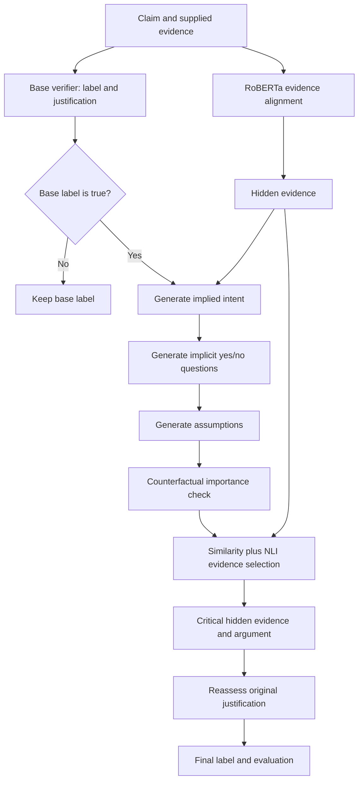

# The Missing Parts: paper and code walkthrough

Source: the supplied 18-page PDF, `../2025.emnlp-main.1724.pdf`, by Yixuan Tang,
Jincheng Wang, and Anthony K. H. Tung (National University of Singapore), EMNLP
2025, pages 33979–33996. Numbers described as reported below come from the paper,
not from our local test. Local dataset counts were independently checked.

## 1. The problem

Fact checking usually asks whether evidence supports a statement. This paper asks
an additional question: does a correct statement leave out facts that would change
the impression it creates?

For example, saying unemployment reached a 50-year low can be accurate. Implying
that this proves broad economic success could still be misleading if many new jobs
are insecure or people have stopped looking for work. This is the paper's
illustrative example, not a factual assessment of a particular administration.

The task is **half-truth detection**. It distinguishes factual correctness from
completeness. Not every omitted fact makes a statement misleading: the omission
must matter to its implied conclusion.

The contributions are a task definition, the POLITIFACT-HIDDEN dataset, and
TRACER: Truth ReAssessment with Critical Hidden Evidence reasoning. TRACER adds
a reassessment stage to an existing fact checker rather than training one single
end-to-end neural network to do everything.

## 2. Terms and inputs

| Term | Meaning |
|---|---|
| Claim C | The statement being checked |
| Evidence E | Context sentences supplied with the claim |
| Presented Evidence, PE | Information already reflected in the claim |
| Hidden Evidence, HE | Relevant context absent from the claim |
| Intent Z | The implied conclusion a reader is encouraged to draw |
| Assumption A | An additional premise needed to connect the claim to that conclusion |
| Critical Hidden Evidence, CHE | Hidden context that materially affects that connection |

“Hidden” means omitted from the claim, not secret or unavailable. The code operates
on evidence already in the dataset; it does not search the web for fresh evidence.
An inferred intent is a model hypothesis about implied meaning, not proof of a
speaker's private motives.

## 3. How the dataset was constructed

The authors use PolitiFact claims and fact-check articles. They separate factual
evidence from verdict/ruling paragraphs using structural markers such as “Our
Ruling.” The ruling is excluded from verification input to reduce label leakage.
Rulings are used during annotation to construct intent targets.

Original labels are consolidated as follows:

| Original rating | Research label |
|---|---|
| True | true |
| Mostly True or Half True | half-true |
| Mostly False, False, or Pants on Fire | false |

This mapping is a benchmark design choice. It should not be interpreted as proof
that every Mostly True example is a deliberate act of deception.

The evidence annotation pipeline checks relevance, checks whether information is
presented in the claim, and refines edge cases with XLM-RoBERTa embedding similarity.
The authors report 88% agreement with human inspection on 50 samples.

Intent annotation first enriches the ruling with evidence, extracts an implicit
conclusion, and filters it for plausibility, implicity, sufficiency, and readability.
Two human annotators checked 100 samples. Table 4 reports agreement of 98.9%,
98.9%, 98.8%, and 92.1% respectively on LLM-positive judgments. These are small
annotation checks, not exhaustive verification of every record.

The supplied files contain:

| Split | True | Half-true | False | Claims | Evidence sentences | Valid intent targets |
|---|---:|---:|---:|---:|---:|---:|
| Train | 1,352 | 4,564 | 6,078 | 11,994 | 217,250 | 10,277 |
| Dev | 64 | 195 | 741 | 1,000 | 13,792 | 713 |
| Test | 93 | 406 | 1,501 | 2,000 | 43,120 | 1,507 |

There are 14,994 claims and 274,162 evidence sentences. The local validation found
no overlapping example IDs across the three splits; that check alone does not prove
absence of semantically duplicated claims. The paper describes the test data as
temporally disjoint, drawn from 2020–2025. Our validation did not independently
certify that temporal claim.

Important JSON fields:

- `example_id`, `claim`, `speaker`, `date`, `source`: identity and claim metadata.
- `evidence`: the input context sentences.
- `annotation`: sentence labels; the released code uses **0 = presented, 1 = hidden**.
- `veracity`: the three-way target for evaluation.
- `ruling`, `enrich_ruling`: reference verdict/explanation and enhanced explanation.
- `intent_gold`, `intent_valid`, `gpt_eval`: annotated intent, validity filter, and quality information.
- `prediction`: added by alignment inference; used downstream instead of gold alignment.

Gold veracity and ruling are recorded in output for analysis, but must not enter
verification prompts. Gold intents are training targets, not test-time inputs.

## 4. What happens to one claim

### Evidence alignment

The implementation concatenates a claim and consecutive evidence sentences,
separated by a newly added `[SPLIT]` token. RoBERTa-large produces contextual
embeddings. A small classification head reads each separator embedding:
linear layer → dropout → ReLU → linear layer → one logit per evidence sentence.
Positive logits predict hidden evidence. Training uses masked binary
cross-entropy, with all encoder and head parameters trainable.

Training samples a random starting position and a random number of consecutive
evidence sentences, up to eight by default. Inference groups evidence into chunks.
The tokenizer limits input to 512 tokens. The repair masks truncated training
targets and splits inference chunks when separators disappear, instead of
classifying missing evidence from padding positions. Individual very long evidence
sentences can still be truncated; this is a model input limitation.

The paper reports five epochs, batch size eight, and learning rate 1e-5. The
released script used 2e-5; the repaired default matches the paper and is configurable.
Context-aware alignment achieves 94.0 accuracy and 91.6 F1, versus 93.2 and 90.3
for the context-unaware baseline (Table 5).

### Literal verification

`method/claim_verification_hiss.py` uses a few-shot HiSS-style prompt with examples
of decomposition and evidence-based questions. It requests a justification and a
final `<true>`, `<half-true>`, or `<false>` label. The default model is GPT-3.5-turbo,
matching the paper's HiSS setup; it can be changed explicitly.

Despite the dialogue-shaped examples, this released implementation makes a single
completion request per attempt with supplied evidence. It is not an interactive
web-retrieval agent. It retries malformed responses up to three times and now raises
an error if none produces a valid label.

### Intent generation

`intent_generation/intent_finetune.py` exports chat-format JSONL training examples
from records with valid annotated intents. In the released training preparation,
only hidden evidence is included. The target is an intended conclusion in angle
brackets. The paper fine-tunes GPT-4o-mini for three epochs with batch size four.

The original inference script computed a filtered evidence list and then immediately
overwrote it with all evidence. The repaired implementation uses predicted hidden
evidence, matching the released training preparation without reading gold alignment
at inference. This is a documented behavioral correction, so exact published numbers
should not be assumed to remain identical.

Fine-tuning data preparation is local. Actually training a hosted intent model is a
separate API operation, and was not performed. A base model can be explicitly used
for an exploratory run, but it does not reproduce the fine-tuned setup.

The paper's intent results (Table 6) are ROUGE-L 37.7 → 46.2, BLEU 6.1 → 8.0,
and BERTScore 91.2 → 91.5, comparing few-shot prompting with fine-tuning.

### Questions, assumptions, and counterfactual checks

The code generates up to four implicit yes/no questions, then up to five assumptions
connecting claim and intent. Appendix B describes 1–3 questions; this is another
small paper/code difference retained from the released implementation.

For each assumption A, a prompt asks how the probability of intent Z would change
under `do(A = not A)`: unchanged, increased, or decreased. The code retains both
increased and decreased cases as relevant. This is an LLM qualitative judgment;
it does not estimate a numerical causal effect or identify a causal relationship
from an experimental dataset.

### Finding critical hidden evidence

`all-MiniLM-L6-v2` embeds assumptions and hidden evidence. Cosine similarity measures
semantic relevance. `cross-encoder/nli-deberta-v3-large` classifies evidence against
each assumption as contradiction, entailment, or neutral. The code retains sentences
with similarity at least 0.45 and the desired entailment/contradiction relation,
ranking and keeping up to three of each kind per assumption.

The resulting argument stores intent, claim, and assumptions with `supported_by`
and `refuted_by` evidence IDs. No evidence passing these checks means no CHE-based
change for that assumption.

### Final reassessment

Only claims initially labeled true enter this path. The reassessment prompt receives
the original model justification, argument, and selected hidden evidence. Options
are true, half-true, false, or unverifiable. Unverifiable preserves the original
prediction. If no backed assumptions are found, the original label also stays.

Consequently this implementation cannot repair a half-truth initially labeled false;
its correction coverage is limited by the base verifier's true predictions.

## 5. Experiments and results reported in the paper

The paper compares QACheck, ProgramFC, CHECKWHY, Flan-T5, CoT, and HiSS. TRACER is
added to CoT and HiSS. The authors generally use GPT-4o-mini, with exceptions where
another backbone performed better; HiSS uses GPT-3.5-turbo.

| Test method | Accuracy | Macro-F1 | Half-true precision | Half-true recall | Half-true F1 |
|---|---:|---:|---:|---:|---:|
| CoT | 76.3 | 64.3 | 45.0 | 63.8 | 52.8 |
| CoT + TRACER | 78.5 | 68.0 | 48.5 | 79.3 | 60.2 |
| HiSS | 78.3 | 59.4 | 53.7 | 37.9 | 44.4 |
| HiSS + TRACER | 81.9 | 65.7 | 55.3 | 66.8 | 60.5 |

Values above use the paper's rounded tables. The README gives additional decimal
places, such as 81.85 accuracy for HiSS + RA. The headline result is approximately
16.1 percentage points of half-true F1 improvement for HiSS. These are not relative
percent improvements.

The other test baselines achieve accuracy/macro-F1 of 48.8/38.6 (QACheck),
56.9/34.2 (ProgramFC), 65.9/54.6 (CHECKWHY), and 70.0/50.4 (Flan-T5).
The paper also reports development scores and per-class F1. For HiSS, adding TRACER
changes true F1 from 44.7 to 46.6 and false F1 from 88.9 to 90.1.

Accuracy is correct predictions divided by all predictions. Macro-F1 averages F1
over the three classes equally. Half-true precision asks how many predicted
half-truths are correct; recall asks how many reference half-truths were found.
F1 is their harmonic mean. The test set is highly imbalanced: always predicting
false would obtain 75.05% accuracy. This is why macro-F1 and half-true F1 matter.

The ablation study (Table 10) is particularly informative:

| Enabled components | Half-true F1 | Macro-F1 |
|---|---:|---:|
| Base HiSS | 44.4 | 59.4 |
| Intent only | 50.9 | 64.7 |
| Intent and assumptions | 61.2 | 61.7 |
| Intent, assumptions, causal filtering | 60.5 | 65.7 |

Causal filtering slightly reduces half-true F1 relative to the assumption-only
variant but improves class-balanced performance. It is a tradeoff, not an increase
in every metric.

The qualitative utility-bill example starts with a true claim that bills increased
during Obama's presidency. The inferred implication blames his policies. Hidden
evidence that increases were faster under Bush and trends were similar weakens
that attribution, producing a half-true reassessment.

Appendix A gives annotation prompts. Appendix B gives question, assumption,
counterfactual, and reassessment prompts. Appendix C reports the LLaMA2-7B
extension: 82.3 accuracy, 65.4 macro-F1, and 61.3 half-true F1 for HiSS + RA.
The main text describes a LLaMA baseline of 78.2/59.1, whereas Appendix Table 11
lists a generic HiSS row of 78.3/59.4; these should not be silently equated.
Its claim-length analysis reports F1 gains of 3.4, 3.3, 7.5, and 6.8 points for
4–13, 14–23, 24–34, and at least 35 words. The longest group has only 44 claims.

## 6. What this repository includes and omits

| File/directory | Responsibility |
|---|---|
| `dataset/*.json` | Prepared train/dev/test data |
| `sentence_alignment/model.py` | Custom encoder and alignment head |
| `sentence_alignment/train_model_script.py` | Alignment data sampling and training |
| `sentence_alignment/predict_model_script.py` | Load checkpoint and add alignment predictions |
| `intent_generation/intent_finetune.py` | Export intent fine-tuning data |
| `intent_generation/prompts.py` | Annotation and intent prompt templates |
| `method/claim_verification_hiss.py` | Literal HiSS-style verification |
| `method/claim_verification_cot.py` | Added local zero-shot CoT baseline (`cot-v1`), with shared label parsing and bounded recovery |
| `method/hidden_info_mining.py` | Intent, assumptions, causal filtering, CHE ranking |
| `method/prompts.py` | Reasoning prompts and model wrappers |
| `method/reassessment.py` | Revisit true predictions using CHE |
| `method/eval.py` | Accuracy, macro-F1, half-true metrics |
| `utils/utils.py` | API helpers and output logging |
| `run_pipeline.py`, `run_local.cmd`, `run_local.ps1` | Added workflow entry points |
| `tests/offline_smoke.py` | Added local integration test |

There is no supplied trained alignment checkpoint, portable fine-tuned intent model,
raw scraping/complete dataset annotation pipeline, full collection of comparison
baselines, automatic ablation runner, or intent-generation metric evaluation code.
The original shell script contained an author's account-specific model ID; it has
been replaced with an explicit user-supplied setting. This repository therefore
does not recreate every table in the paper with one command.

## 7. Limitations and interpretation

The authors identify political-domain coverage and ambiguous/multiple intents as
limitations. More generally, intent and counterfactual judgments can be wrong;
hidden evidence quality depends on the supplied article and the alignment model;
and multiple model stages can compound errors. The causal prompt is a heuristic,
not experimental proof. Annotation checks are small, and label consolidation is
coarser than the original ratings. Hosted model versions and stochastic responses
also affect repeatability.

The local test establishes that the repaired software stages connect and finish.
It does not establish scientific accuracy, fairness, calibration, the quality of
the downloaded neural rankers, or reproduction of the paper's reported gains.
See `RUNNING.md` for exactly what was executed and what remains external.
